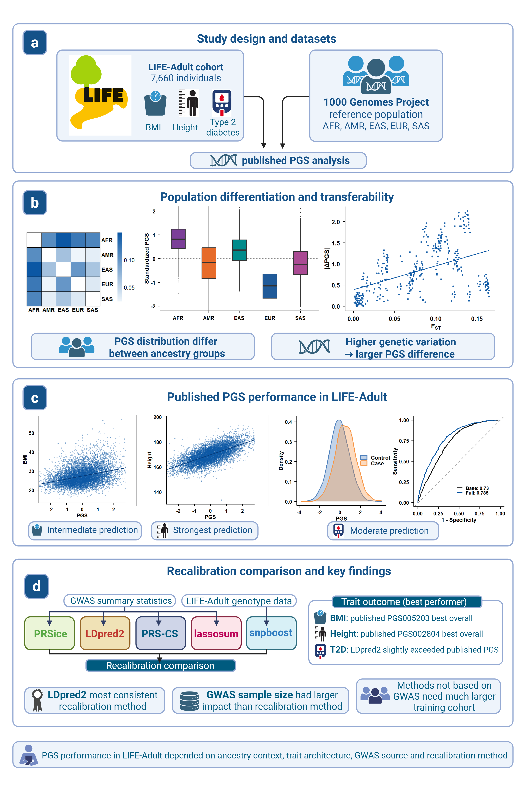

# Evaluation and Recalibration of Polygenic Scores

  

## Overview

This repository contains the analysis scripts used for my Master's thesis investigating the construction, evaluation, transferability, and recalibration of polygenic risk scores (PRS) across diverse ancestry groups.

The project combines analyses of published polygenic scores from the PGS Catalog with the development of recalibrated PRS models using several widely used methods. Performance was evaluated in the LIFE-Adult cohort, while ancestry-dependent score distributions and genetic differentiation were investigated using the 1000 Genomes Project.

The complete study workflow is summarized in the figure above and consists of three main components:

1. **Population differentiation and transferability**
   - Population-level analyses were performed using the 1000 Genomes Project reference populations.
   - Pairwise Hudson's \(F_{ST}\) was calculated between populations and superpopulations.
   - Published PRS distributions were compared across ancestry groups.
   - Genetic differentiation was related to differences in PRS distributions.

2. **Evaluation of published PRS**
   - Published scores from the PGS Catalog were applied to the LIFE-Adult cohort.
   - Predictive performance was assessed using linear or logistic regression, depending on the phenotype.

3. **PRS recalibration**
   - Published scores were compared with recalibrated models generated using **PRSice**, **LDpred2**, **PRS-CS**, **lassosum**, and **snpboost**.
   - The influence of GWAS sample size, recalibration method, and training cohort size on prediction performance was evaluated.

Each analysis directory contains an R Markdown notebook describing the required inputs and reproducing the corresponding analysis.
---

# Data

1000 Genomes Project Phase 3 (https://www.internationalgenome.org/data) used as reference panel for

- PRS calculation
- allele frequency estimation
- ancestry comparisons
- FST calculation

Individual-level genotype and phenotype data from the LIFE-Adult cohort (not publicly available) was used for

- PRS evaluation
- recalibration methods

Published polygenic scores were downloaded from https://www.pgscatalog.org/

Trait-specific GWAS summary statistics were downloaded from the original publications or associated repositories.

---

# PRS construction methods

## LDpred2

Implementation based on the **bigsnpr** R package.

Reference: Privé F, Arbel J, Vilhjálmsson BJ (2020) LDpred2: better, faster, stronger.

Repository: https://github.com/privefl/bigsnpr

---

## PRS-CS

Implementation of PRS-CS using the official Python software.

Repository: https://github.com/getian107/PRScs

---

## PRSice

PRS generated using PRSice-2.

Repository: https://github.com/choishingwan/PRSice

---

## lassosum

Implementation using the lassosum R package.

Repository: https://github.com/tshmak/lassosum

---

## snpboost

Implementation of component-wise boosting using individual-level genotype data.

Repository: https://github.com/biometrische-gesellschaft/snpboost

Unlike the other methods, snpboost does **not** rely on GWAS summary statistics but instead trains directly on genotype and phenotype data from the LIFE-Adult cohort.
